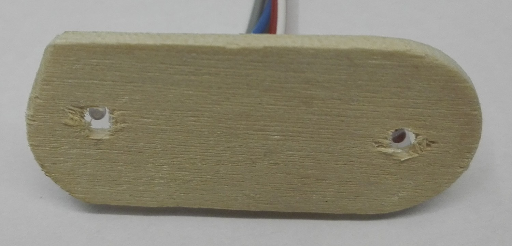
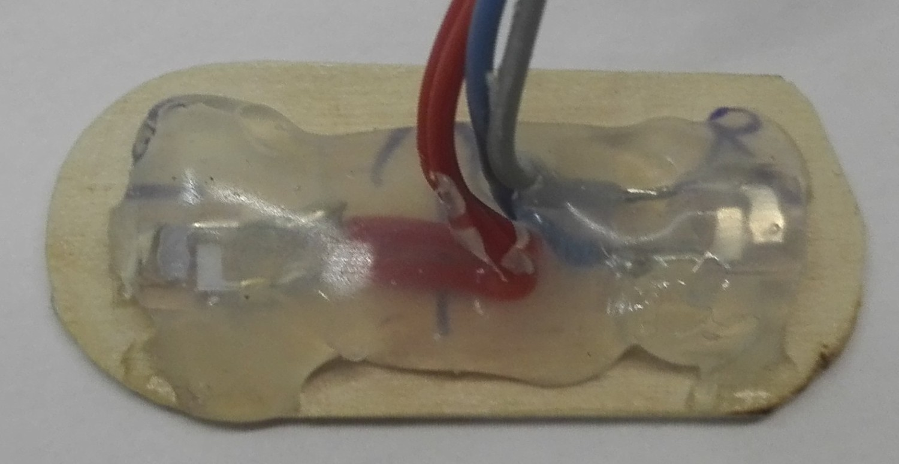
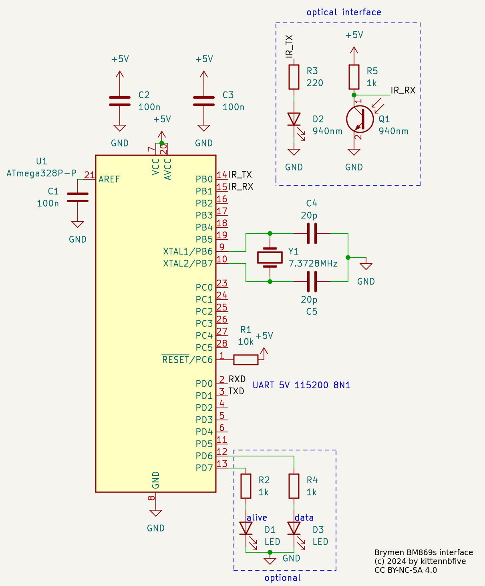

# 869log

A cheap PC interface for Brymen BM869s multimeters (hardware+software)

## What is this?
This repo contains a DIY alternative to the commercially available PC interface BU-86x for Brymen BM869s and possibly other multimeters. The hardware is currently based around a ATmega328P (POC only). The software is text mode and Linux only. Everything was written from scratch.

## Licence and disclaimer
The content of this repo is licenced under AGPLv3+ (code) / CC BY-NC-SA 4.0 (schematic and pictures) and comes WITHOUT ANY WARRANTY!

## Acknowledgements
* Thanks to Brymen for publishing a short specification that contains the mapping of the individual data bits to the LCD segments. Figuring this out would have been long and painful. I will not link directly to the pdf as the URL seems to change quite often, just search for "500000count-professional-dual-display-DMMs-protocol.pdf" or similar.
* Thanks to the folks over at the EEVblog forum who figured out the (undocumented) low level protocol stuff.

### Hardware
#### Interface
The interface is optical. This is **really important** as it ensures insulation between the (potentially letal) voltages going inside the meter (e.g. if you are measuring mains voltage) and your computer (and your body)! The wavelength used is 940nm (=infrared). You will find plenty of suitable LED and phototransistors on your favourite electronics parts website. I had some ITR9606-F "Opto Interrupter" laying around that are working at the needed wavelength, so i destroyed one to get the bare LED and phototransistor.
#### Mounting
You need some kind of "bracket" to hold the LED and phototransistor in place. If you don't mind a permanent connection, hot glue is probably the easiest way. I used a piece of wood that i carefully shaped to slide between the two plastic "slots" on the meter. Then i drilled to holes through the wood and mounted the LED and phototransistor with hot glue. It works... (I don't have access to a 3D printer.) If you look at the meter from the back the LED goes on the *left* side.


#### Protocol
It's quite basic: You send a pulse (=LED ON) with a duration of 10ms (or more), then wait for the LED inside the meter to turn on and then send 160 light pulses while receiving data (160/8=20 bytes) from the meter. What you get is an encoded representation of the individual segments of the LCD, so some code is needed to "translate" this into human-readable text. I did this on the PC as there is more processing power available and - more important - it is easier to debug.
#### The full receiver
Currently the receiver is a proof of concept only. I used a way too big ATmega328P but plan to port the code to a much smaller (physically speaking) micro. This is why at this point i will not publish the source code for the firmware but only a `.hex`-file. The AVR requests the data from the multimeter and sends it to the PC over serial (raw binary data, 115200 8N1).  
Adjust resistance values depending on your LED and phototransistor.

Fuses: L:0xF7 H:0xD9 E:0xFF

### Software
The software is written in C and **for Linux only**. With WSL you may somehow be able to make it run on Windows, but i can't and won't provide any support for this.
#### Overview
The `main`-function parses some options, does some init-stuff for the serial port and soon `fork()`s to split itself into 2 parts:
* An `uart_worker()` that manages the serial interface.
* An `interface()` that crunches the received data.

Both parts are communicating using "messages" sent through unnamed pipes. The actual decoder that makes senses of the raw data from the AVR lives insides - you guessed it - `decoder.c/h`. Please note that the decoder is somewhat messy, incomplete und mostly untested. Feedback welcome.
#### How to compile
`gcc -Wall -Wextra -o 869log main.c uart_worker.c intercom.c fifo.c interface.c decoder.c`  
No dependencies (except `libc` of course).
#### How to use
```
usage: 869log [--port $serial_port] [--once|--twice] [--relative-time] [--output-file $file]
	--port $serial_port tells the software to use $serial_port instead of /dev/ttyUSB0 by default
	--once instructs the AVR to request 1 reading per second
	--twice is the same but 2 readings per second
	By default the tool shows as many readings as the meter can return.
	--relative-time does not show current date/time but a clock starting at 00:00:00 once data is received
	--output-file $file writes received and decoded data to $file in addition to showing it on the screen
```

### Comments/Notes
* Further processing of the received data can and should be done with standard Linux tools. This software will never get a plotting function, a **G**UI and similar stuff.
* The mode-switching (as fast as possible, one reading per second, two readings per second) is done by sending a single byte ('c'/'o'/'t' respectively) to the AVR at any time.
* Due to multitasking, several buffers at different layers of Linux and other stuff the displayed time for each reading is not really accurate; however the readings once/twice a second are timed from inside the AVR (using Timer1 currently) so the delay should always be the same to some extend.
