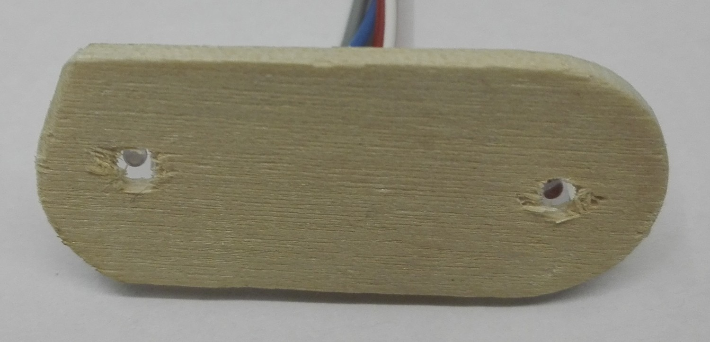
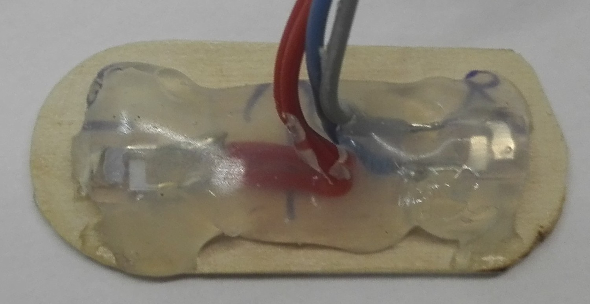
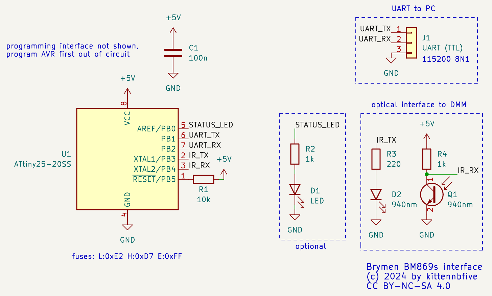
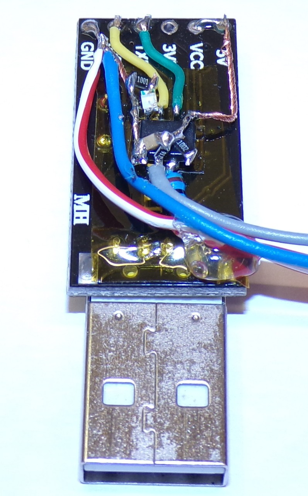
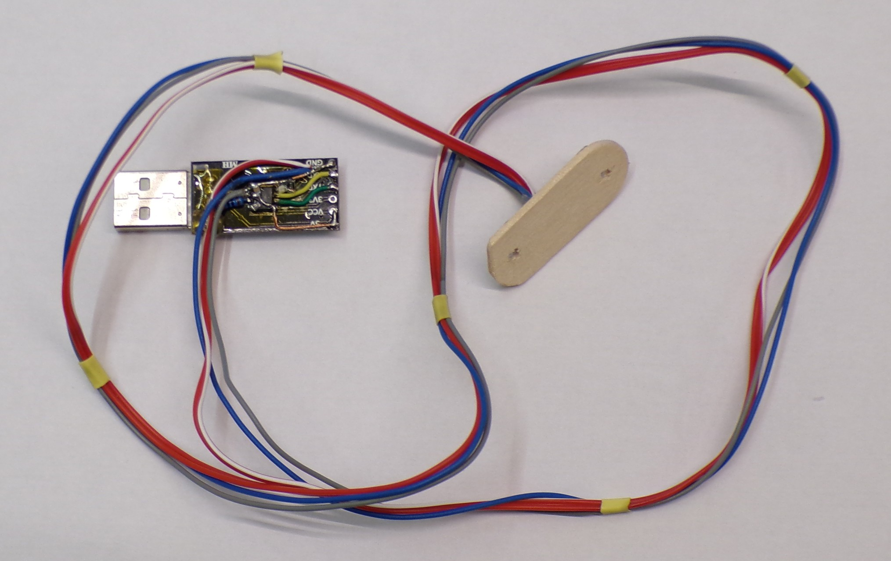

# 869log

A cheap PC interface for Brymen BM869s multimeters (hardware+software). Based on Attiny25.

## What is this?
This repo contains a DIY alternative to the commercially available PC interface BU-86x for Brymen BM869s and possibly other multimeters. The hardware is based around a Attiny25 and whatever USB to serial module you have in stock. The software is text mode and Linux only. Everything was made/written from scratch.

## Licence and disclaimer
The content of this repo is licenced under AGPLv3+ (code) / CC BY-NC-SA 4.0 (schematic and pictures) and comes WITHOUT ANY WARRANTY!

## Acknowledgements
* Thanks to Brymen for publishing a short specification that contains the mapping of the individual data bits to the LCD segments. Figuring this out would have been long and painful. I will not link directly to the pdf as the URL seems to change quite often, just search for "500000count-professional-dual-display-DMMs-protocol.pdf" or similar.
* Thanks to the folks over at the EEVblog forum who figured out the (undocumented) low level protocol stuff.

## Multimeter interface
The interface with the BM869s is optical, as for most (all?) multimeters on the market. This is **really important** as it ensures insulation between the (potentially letal) voltages going inside the meter (e.g. if you are measuring mains voltage) and your computer (and your body)! The wavelength used for the BM869s is 940nm (=infrared). You will find plenty of suitable LED and phototransistors on your favourite electronics parts website. I had some ITR9606-F "Opto Interrupter" laying around that are working at the needed wavelength, so i destroyed one to get the bare LED and phototransistor.
### Mounting
You need some kind of "bracket" to hold the LED and phototransistor in place. If you don't mind a permanent connection, hot glue is probably the easiest way. I used a piece of wood that i carefully shaped to slide between the two plastic "slots" on the meter. Then i drilled to holes through the wood and mounted the LED and phototransistor with hot glue. It works... (I don't have access to a 3D printer.) If you look at the meter from the back the LED goes on the *left* side.


### Protocol
It's quite basic: You send a pulse (=LED ON) with a duration of 10ms (or more), then wait for the LED inside the meter to turn on and then send 160 light pulses while receiving data (160/8=20 bytes) from the meter. What you get is an encoded representation of the individual segments of the LCD, so some code is needed to "translate" this into human-readable text. I did this on the PC as there is more processing power available and - more important - it is easier to debug.

## Hardware
Everything should be in the schematic. Adjust resistance values depending on your LED and phototransistor. *Make sure you programm the AVR before soldering (_fuses and code_)!*

### Code
The firmware was written in assembly (yikes!) due to timing problems. Indeed the Attiny25 does not have a UART and making a (kinda) full-duplex one work in C is not easy, especially with a single 8 Bit timer available (the other timer was needed for data acquisition from the DMM) and ~8MHz system clock.  
Build the firmware using `avr-gcc -mmcu=attiny25 -o avr.elf main.S` and flash with your favourite tool. Don't forget setting the fuses!
### The trouble with the missing crystal
The Attiny25 has 5 GPIO (6 if you can disable RESET and have a way to still program the chip). We need 2 of them for UART, 2 of them for the DMM-interface and the last one was used for a LED to provide at least *some* feedback to user. This means there is no way to connect a crystal to the AVR, but the internal 8 MHz oscillator is unsuitable for "fast" UART (115200).  
The solution was to use the `OSCCAL` register to slightly lower the 8MHz to about 7,3728MHz which would be perfect for "fast" UART. To avoid having to do this manually an autocalibration procedure was added to the firmware using the UART as a reference. Indeed if you continously send 0x55 you basically have a perfect square wave with fixed, known frequency. Once the correct `OSCCAL` value (which will vary between several Attiny25 and is also a function of voltage, temperature, ...) is known it is stored inside EEPROM.  
**Please note that this calibration procedure is highly experimental and may fail for some parts depending on voltage, temperature, process variations during manufacturing of the AVR, ...**
### A point to consider
The datasheet of Attiny25 states on page 32:
>To ensure stable operation of the MCU the calibration value should be changed in small. A variation in frequency of more than 2% from one cycle to the next can lead to unpredicatble behavior. Changes in OSCCAL should not exceed 0x20 for each calibration.

The current code is violating this as - assuming the initial calibration was done once - on startup the `OSCCAL` value is read from EEPROM and directly written to `OSCCAL`. To be in spec we would need to adjust `OSCCAL` slowly (inside a loop or similar) until the correct value is reached. However for me writing `OSCCAL` directly works fine too. YMMV. 
### Initial startup
The calibration procedure needs to be done once at the very first time the dongle is connected to a PC. The status LED (see below) will blink 3 times and then stop. At this point the actual DMM interface is **not** yet functional! You will need to provide a "calibration signal" via UART for like one or two seconds. To do this you can use these commands from Linux, assuming your USB to serial module is `/dev/ttyUSB0` (adjust as needed). Leave it running for a few seconds and then stop with Ctrl+C.
```
stty -F /dev/ttyUSB0 raw 115200
cat /dev/zero | tr "\000" "\125" > /dev/ttyUSB0
```
### Status LED
Due to pin constraints there is only a single LED to provide some feedback. Here is some help to interpret the blinky stuff:
* 3 slow blinks and then nothing: Waiting for calibration signal via UART, see above.
* (during calibration) continous fast blink: Calibration failed. :(
* continous slow blink: Waiting for data from DMM, check if your "dongle" is correctly mounted and the DMM switched on.
* fast(-ish) flashes: Receiving data from DMM and transmitting via UART. This is the mode you want.

## Software
The software is written in C and **for Linux only**. With WSL you may somehow be able to make it run on Windows, but i can't and won't provide any support for this.
### Overview
The `main`-function parses some options, does some init-stuff for the serial port and soon `fork()`s to split itself into 2 parts:
* An `uart_worker()` that manages the serial interface.
* An `interface()` that crunches the received data.

Both parts are communicating using "messages" sent through unnamed pipes. The actual decoder that makes senses of the raw data from the AVR lives insides - you guessed it - `decoder.c/h`. Please note that the decoder is somewhat messy, incomplete und mostly untested. Feedback welcome.
### How to compile
`gcc -Wall -Wextra -o 869log main.c uart_worker.c intercom.c fifo.c interface.c decoder.c`  
No dependencies (except `libc` of course).
### How to use
```
usage: 869log [--port $serial_port] [--once|--twice] [--relative-time] [--output-file $file]
	--port $serial_port tells the software to use $serial_port instead of /dev/ttyUSB0 by default
	--once instructs the AVR to request 1 reading per second
	--twice is the same but 2 readings per second
	By default the tool shows as many readings as the meter can return.
	--relative-time does not show current date/time but a clock starting at 00:00:00 once data is received
	--output-file $file writes received and decoded data to $file in addition to showing it on the screen
```

## Pictures
I made a "dead bug" style construction on the back of an USB to serial adapter. Once the dongle was confirmed working i used hot glue to protect the electronics. As i said, i don't have access to a 3D printer to make a nice enclosure. The cable was salvaged from another old, dead project (recycle, reuse, ...).  




## Comments/Notes
* Further processing of the received data can and should be done with standard Linux tools. This software will never get a plotting function, a **G**UI and similar stuff.
* Due to multitasking, several buffers at different layers of Linux and other stuff the displayed time for each reading is not really accurate; however the readings once/twice a second are timed from inside the AVR, so the delay should always be the same to some extend.
